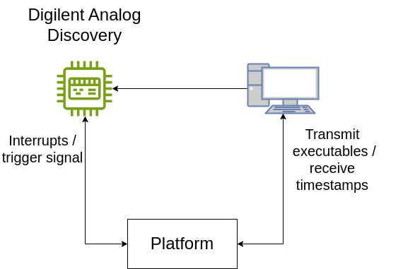
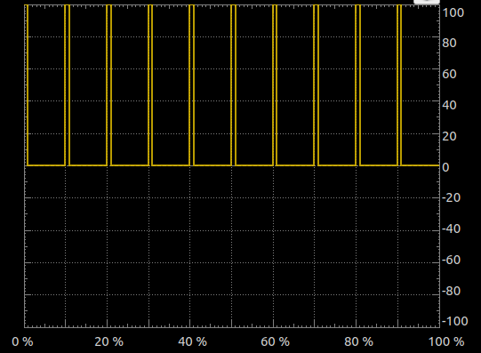
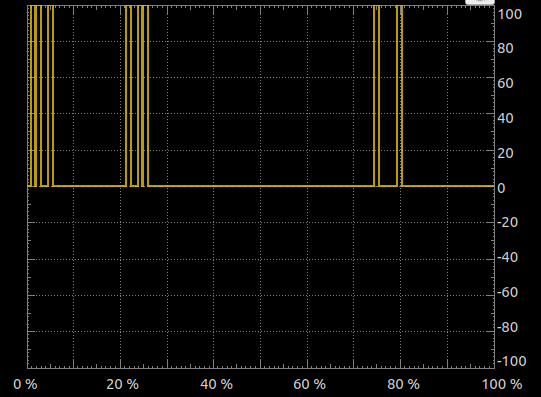
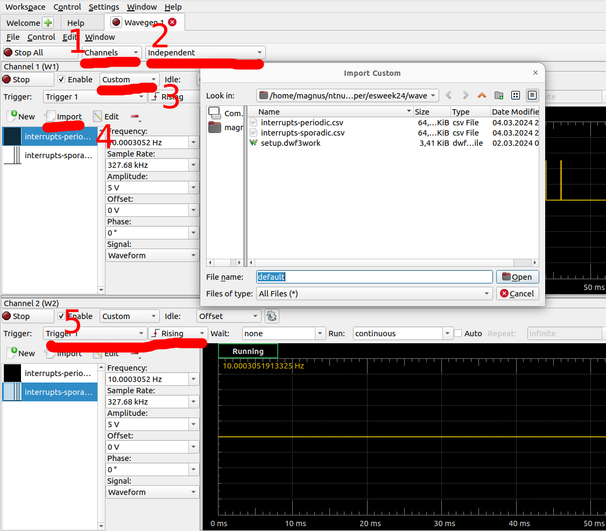
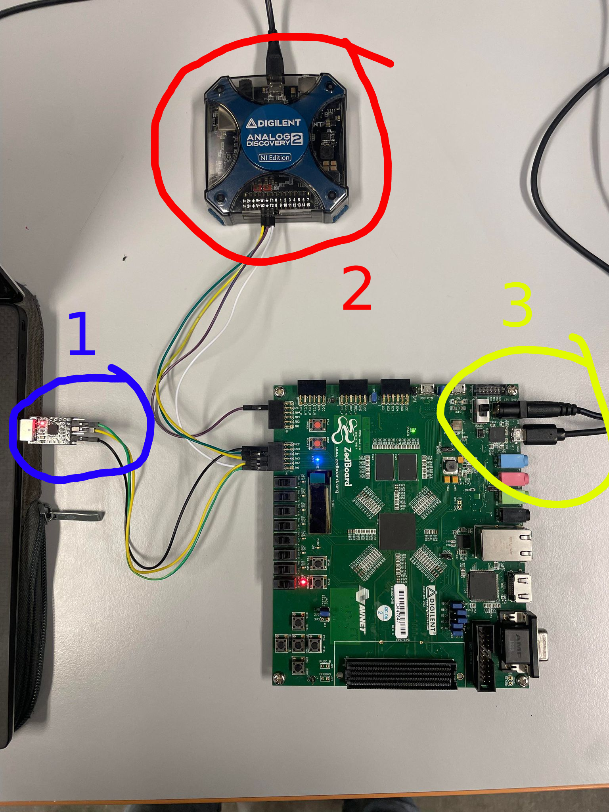
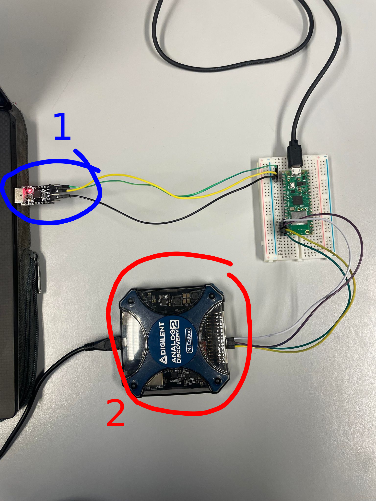
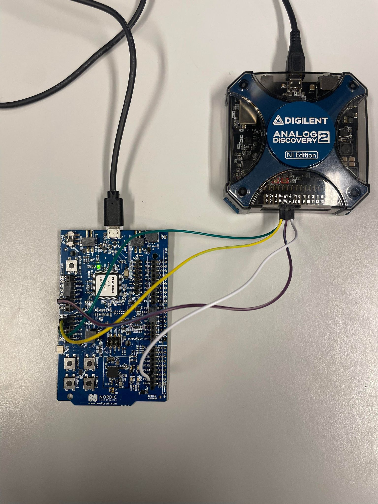
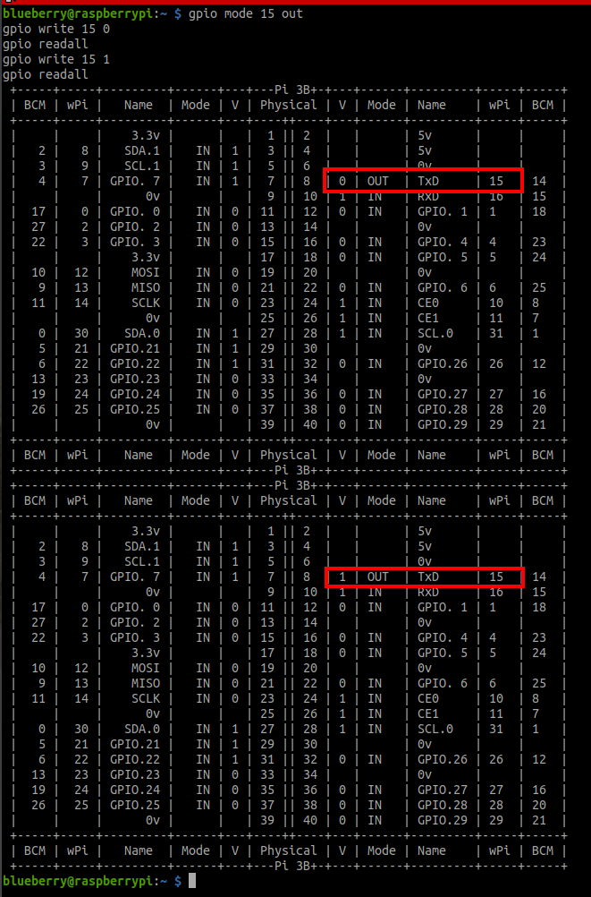
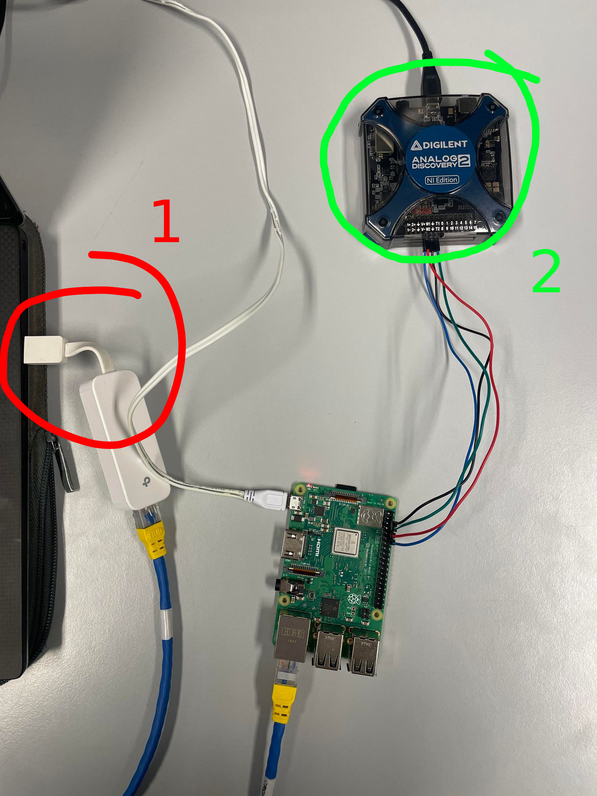

# Introduction

This README.md describes the setup for running the benchmarks in the paper titled `Programming Time-predictable Processors with Lingua Franca`. Anyone should be able to reproduce the results, though this admittedly would require some efforts. Specifically in terms of getting the correct hardware. 

You will find the most important results in the [figs](./figs) folder. These are created using the scrips in the [scripts](./scripts/) folder.

# Table of contents

- [Introduction](#introduction)
- [Table of contents](#table-of-contents)
- [Benchmarks](#benchmarks)
  - [Tight control loop in Lingua Franca](#tight-control-loop-in-lingua-franca)
  - [Parallel reactions in Lingua Franca](#parallel-reactions-in-lingua-franca)
  - [Interrupt robustness in C (not used in paper)](#interrupt-robustness-in-c-not-used-in-paper)
  - [Setup](#setup)
    - [Periodic vs. sporadic interrupts](#periodic-vs-sporadic-interrupts)
- [Prerequisites](#prerequisites)
  - [Hardware](#hardware)
  - [Software](#software)
- [Interrupt pulse generation](#interrupt-pulse-generation)
  - [Other methods of interrupt pulse generation](#other-methods-of-interrupt-pulse-generation)
- [Platform specifics](#platform-specifics)
  - [FlexPRET](#flexpret)
    - [Physical setup](#physical-setup)
  - [RP2040](#rp2040)
    - [Physical setup](#physical-setup-1)
  - [nrf52dk\_nrf52832 (aka nrf52)](#nrf52dk_nrf52832-aka-nrf52)
  - [Raspberry Pi 3b+ (aka RPi)](#raspberry-pi-3b-aka-rpi)
    - [ssh key login](#ssh-key-login)
    - [Software setup](#software-setup)
    - [Hardware setup](#hardware-setup)


# Benchmarks

For this repository, experiments are conducted for four different platforms.
1. FlexPRET: a RISC-V precision-timed machine programmed in bare-metal C,
2. RP2040: an arm processor programmed in bare-metal C,
3. nRF52dk_nRF52832: an arm processor running Zephyr RTOS,
4. Raspberry Pi 3b+: an arm processor running a Linux-based OS.

The three latter span the typical design space of an embedded system; from bare-metal to an embedded OS to a "full-blown" OS. On the other hand, FlexPRET is a rather niche processor designed for mixed-criticality systems. The experiment results highlight the advantages of FlexPRET.

The purpose of the experiments is to evaluate jitter (time deviation of computations) on these four platforms, and techniques to mitigate them. These techniques include computer architecture design for predictable timing (e.g., precision-timed machines) and using programming languages with timing semantics (e.g., Lingua Franca).

## Tight control loop in Lingua Franca

The first benchmark implements a simulated tight control loop in Lingua Franca. Interrupts are triggered while the benchmark runs to evaluate the robustness of the underlying platform. The benchmark is run on all four platforms. The benchmarks physical setup is described in [Setup](#setup). Refer to the paper for more details and results.

## Parallel reactions in Lingua Franca

The second benchmark implements three reactors in Lingua Franca that can be run in parallel. It is run on FlexPRET and nRF52. The benchmark is used to evaluate the single threaded versus multithreaded Lingua Franca runtime. This does not include interrupts, so the benchmark setup is much less complicated. The benchmarks physical setup is described in [Setup](#setup), but the Analog Digital Discovery is not used here. Refer to the paper for more details and results.

## Interrupt robustness in C (not used in paper)

This benchmark is not included in the paper because the same robustness is evaluated in the first benchmark. It measures the time it takes to finish a long computation. If interrupts occur during the computation, this yields jitter.

## Setup

Figure 1 shows the setup for the benchmark. The *platform* block is replaced by either of the four platforms, but can be replaced by any other platform as well. 

Figure 1: A diagram of the setup for an experiment.



The personal computer is connected to a [Digilent Analog Discovery](https://digilent.com/reference/test-and-measurement/analog-discovery-2/start), which acts as a waveform generator. Waveforms can be generated on at maximum two output pins - this setup generates *periodic* interrupts on one and *sporadic* interrupts on another. Waveform generation can be triggered by e.g., the rising edge of an external signal. This trigger signal is connected to a general-purpose IO (GPIO) pin on the target platform, and set high when the platform has finished initalization.

Each program/experiment running on the platform is implemented with the following basic structure:

1. Configure the pins connected to the waveform generator as interrupt pins, set interrupt handlers, and enable interrupts.
2. Set trigger signal high to trigger waveform generation.
3. Perform some computation for `N` iterations and append timestamps to a pre-allocated array.
4. Disable interrupts.
5. Print out the entire timestamp array to personal computer.

The timestamp arrays are then stored on disk and later analyzed.

The same program/experiment can be run with and without interrupts - the only difference is whether waveform generation on the Digilent Analog Discovery is enabled or disabled. The results show that running the experiments with interrupt generation introduces jitter into the timestamp array for all platforms except FlexPRET.

### Periodic vs. sporadic interrupts

Interrupts that arrive with some constant period (e.g., every 10 ms) are referred to as periodic interrupts. In an embedded system, this could typically be a sensor. 

Interrupts that arrive in a random/sporadic fashion are referred to as sporadic interrupts. This could for instance be packets arriving on a network interface. The characteristics of such packet arrivals are very application-based, but for this  it is assumed that a) multiple packets tend to arrive in a small time window and b) the network interface does not receive packets most of the time.

In the experiments, periodic and sporadic interrupts are handled differently. Periodic interrupts require computation for `WORK_AMOUNT_INT_PERIODIC` time, while sporadic interrupts require `WORK_AMOUNT_INT_SPORADIC` time to compute. These macros are set in `experiments/lib/common.h`. These are intended to be different. Because of this, it is important not to mix up pin connections between the waveform generator and the platform.

Figure 2: Periodic interrupts




Figure 3: Sporadic interrupts



# Prerequisites

Only the major prerequisites are listed here. Do not consider this list complete.

## Hardware

1. FlexPRET is synthesized down to an Field-Programmable Gate Array (FPGA). In theory, any FPGA with more than or equal hardware resources to a [Zedboard Zynq-7000](https://digilent.com/shop/zedboard-zynq-7000-arm-fpga-soc-development-board/) should work. Refer to [the FlexPRET repository](lf-flexpret/flexpret/) for more information. In addition, it needs:
   * A power supply (which probably comes with the FPGA).
   * A micro-USB cable for uploading bitstreams.
   * A USB-UART dongle to upload new software and use standard input/output.
2. RP2040w can be procured [online](https://www.elektor.com/products/raspberry-pi-pico-rp2040-w). It also needs:
   * A micro-USB cable to upload new software.
   * Optional: a USB-UART dongle for standard input/output.
3. nRF52dk_nRF52832 can be procured [online](https://www.nordicsemi.com/Products/Development-hardware/nRF52-DK). It also needs:
   * A micro-USB cable to upload softare and for standard input/output.
4. Raspberry Pi 3b+ (or any other Raspberry Pi, for that matter). It also needs:
   * A Raspberry Pi power supply.
   * A micro-SD card for operating system.
   * Either a router or ethernet cable to connect remotely from your own computer.
   * Optional: a monitor, keyboard, mouse etc. to more easily interface with it.
5. Digilent Analog Discovery is bought [online](https://digilent.com/reference/test-and-measurement/analog-discovery-2/start). There might be newer versions, which probably are better. 
6. A number of male-male, female-female, male-female jumper cables.

## Software

1. Vivado for synthesizing RTL code.
2. Waveforms for using Digilent Analog Discovery.

# Interrupt pulse generation

Digilent Analog Discovery comes with a simple-to-use GUI-based program called [Waveforms](https://digilent.com/shop/software/digilent-waveforms/). A [guide](https://digilent.com/reference/test-and-measurement/guides/waveforms-waveform-generator) explains how to use the waveform generator. The waveform generator features some methods to generate waveform patterns, but generating sporadic interrupt pulses at specific times (such as the ones in Figure 3) is best done using Python. Use [configuration file](./wave/setup.dwf3work) to get the configuration used for these benchmarks out-of-the-box.

`scripts/genwaves.py` generates a .csv file, which can be uploaded to the Waveform generator. See Figure 5, which highlights some aspects. This list is not meant as a complete guide; refer to the official documentation for more in-depth details.

1. Select which channels (W1, W2) to use.
2. Select whether they shall be synchronized to some trigger. Select `no synchronization` for testing purposes, but use `independent` when using the GPIO trigger signal from the platform.
3. Select `custom` to be able to upload `.csv` files.
4. Import a `.csv` file here.
5. Set the trigger type for the channel (W1, W2). The experiments are set up to provide a rising edge on a GPIO pin when they have finished initalization, so select `Trigger 1` (or 2) with rising edge to synchronize the experiments and the waveform generator.

Note: For some reason, the waveforms do not display correctly. To verify that the waveforms generated indeed are correct, a possible solution is to connect W1 to a digital input and probe it using the logic analyzer. (How convenient!)

Figure 5: 


## Other methods of interrupt pulse generation

There are of course other ways to generate interrupt pulses. Some ideas are:
1. Use a USB<->UART dongle, set it to a low baudrate, and write `0x00` to it. That might yield a low pulse on the `TX` signal for enough time. However, it is not very easy to control. See [uart.py](./scripts/uart.py) for a script that was used to do this before it was replaced with the Digital Analog Discovery.
2. Use an additional microcontroller. It does however increase the complexity of the experiment and introduces *yet* another embedded system to manage.

# Platform specifics

The four platforms all have their own setup guides. The below only describes what additional setup or changes are necessary for this experiment.

## FlexPRET

For this experiment, FlexPRET is run on a Field-Programmable Gated Array (FPGA). FPGAs can be reconfigured to hold any digital circuit, implemented in hardware descriptive languages (HDL). Processors are just complicated digital circuits.

To get FlexPRET running on an FPGA, refer to the documentation available in [FlexPRET's README.md](./lf-flexpret/flexpret/README.md). Make sure to build FlexPRET with at least three hardware threads - although four or eight are probably the most sensible options.

At the time of writing, FlexPRET is not integrated into the Lingua Franca compiler (`lfc`) and uses version 0.4.1. Therefore, build the 0.4.1 version of the compiler.

```
cd lf-flexpret/lingua-franca
./gradlew assemble
```

Verify that it indeed is version 0.4.1.

```
./bin/lfc --version
```

It should output `0.4.1-SNAPSHOT`. Make sure you are using this `lfc` when compiling for FlexPRET. This is done in the automated scripts.

### Physical setup

See Figure 6 for the physical setup.
1. This is a USB<->UART dongle used to communicate with FlexPRET. It is used to transmit software to FlexPRET's bootloader and acts as standard output after. The timestamp array is output here. Three jumpers are connected: `UART_RX`, `UART_TX` and ground.
2. This is the Digilent Analog Discovery used to generate waveform sinals. Four jumpers are connected: two waveform output signals, one trigger signal, and ground.
3. This is power to the Zedboard (upmost) and micro-USB to reconfigure the FPGA.

The exact mappings of the pins are not easily derived from Figure 6. This is on purpose, because the pin mapping is likely to become outdated. Refer to FlexPRET documentation or the relevant `.xdc` file to find this mapping.

Figure 6: The physical setup for FlexPRET.


## RP2040

Refer to the [official documentation](https://www.lf-lang.org/docs/embedded/rp2040) for intial setup. Some steps can be skipped, as the documentation is based on an introductory course to embedded systems.  The documentation uses the RP2040 integrated into [Pololu 3pi+ 2040 robot](https://www.pololu.com/docs/0J86), so aspects of the guide are not relevant. 

To upload new software to the RP2040, the `BOOTSEL` button must be pressed down while the system is powered on. The only way to power on/off the system is to plug a micro-USB in and out. By default, the RP2040 uses the same micro-USB connection for standard output, but getting it to standard output mode requires another plug in and out, without pressing down the button. From experience, this does not always work - the `/dev/ttyACM0` does not always appear in this case.

Another method to get "standard" output is to connect another USB<->UART dongle and replace `printf` with `printf_custom` that just prints to that UART instead. That was done in `experiments/lib/RP2040/printf_custom.c`. This automates the experiment slightly more, but in return adds another piece of hardware. Feel free to use the micro-USB if this is easier - but this requires some slight changes to the C code.

### Physical setup

See Figure 7 for the physical setup. The RP2040's pinout can be found [here](https://www.raspberrypi.com/documentation/microcontrollers/raspberry-pi-pico.html).

1. This is a USB<->UART dongle used to retrieve the timestamp array when the program/experiment is finished. Three jumpers are connected: `UART_RX`, `UART_TX` and ground. They are connected to the pins 1-3 on RP2040.
2. This is the Digilent Analog Discovery, which is used for waveform generation. The Discovery's T1 pin is connected to pin 17, and its W1-W2 pins are connected to pins 19-20. Make sure not to mix up periodic/sporadic interrupts.

Figure 7: The physical setup for RP2040.


## nrf52dk_nrf52832 (aka nrf52)

This setup is arguably the simplest. Standard output is available from the micro-USB interface. The pins are connected like so:

* Disovery's W1 -> nrf52's P0.03 (A0)
* Disovery's W2 -> nrf52's P0.04
* Disovery's trigger -> nrf52's P0.05
* Disovery's ground -> nrf52's ground

Figure 8: Setup for nrf52.


## Raspberry Pi 3b+ (aka RPi)

There are plenty of guides availble for setting up Raspberry Pi (RPi). Setting up a static IP address is recommened. Furthermore, setting up `ssh` keys and configuration to skip password login is important for automating the experiments. The setup assumes the RPi is accessible over `ssh`.

### ssh key login

Start off by generating a key pair.

```
cd ~/.ssh
ssh-keygen
```

Name the key something descriptive. (The default name is not descriptive.) Copy the key over to the RPi. This will require a password.

```
ssh-copy-id <username>@<hostname> -i <path to key.pub>
```

Attempt to login using the key only to make sure it works. (Note: Use the private key here, not the `.pub` one.)

```
ssh <username>@<hostname> -i <path to key>
```

Next, add the following lines to the file `~/.ssh/config`. If it does not exist, create it.

```
Host <name>
    HostName <hostname>
    User <username>
    IdentityFile <path to private key>
```

An example file:

```
Host blueberry
    HostName 10.42.0.65
    User blueberry
    IdentityFile ~/.ssh/rpi/blueberry
```

Now it should be possble to run

```
ssh <name>
```

to login without using a password. With this setup, it might be useful to disable password logins - this makes the RPi much more secure.

### Software setup

The RPi must install WiringPi and Cmake. Unfortunately, as of 2024, WiringPi was discontinued by the initial author. See the previously [initial website](http://wiringpi.com/index.html). Fortunately, it is kept alive on [Github](https://github.com/WiringPi/WiringPi). Install it using the guide there.

Using WiringPi, it is possible to check GPIO pins using `gpio readall`. Verify that it works:

```
gpio mode 15 out
gpio write 15 0
gpio readall
gpio write 15 1
gpio readall
```

You should be able to see some changes on the pin labeled wPi 15, as in Figure 9. The `gpio` program is just a utility; the underlying library is used in the program/experiment.

Warning: WiringPi uses a different numbering scheme of RPi's GPIO pins. In `gpio readall`, the `BCM` column refers to the numbering scheme in the RPi documentation. Everything else uses the wPi numbering scheme, however.

Also install Cmake:

```
sudo apt install cmake
```

Figure 9: Output from testing gpio utility program.


The Lingua Franca compiler does not need to be installed on the RPi, because the compiler is with the `-n` option on the host computer. This only generates C code. The code is then copied to the RPi using `scp` and compiled there. The extensive use of `scp` is the reason why the setup in [ssh key login](./README.md#ssh-key-login) was necessary.

### Hardware setup

Figure 10 depicts the hardware setup.

1. Ethernet connection to the RPi. WiFi is another option.
2. Digilent Analog Discover, which is used to generate interrupt pulses. Four jumpers are connected:
   1. Discovery's ground -> RPi's ground
   2. Discovery's trigger -> RPi's `wPi` 15 (or `BCM` 14)
   3. Discovery's W1 -> RPi's `wPi` 16 (or `BCM` 15)
   4. Discovery's W2 -> RPi's `wPi` 1 (or `BCM` 18)

Figure 10: RPi setup.

