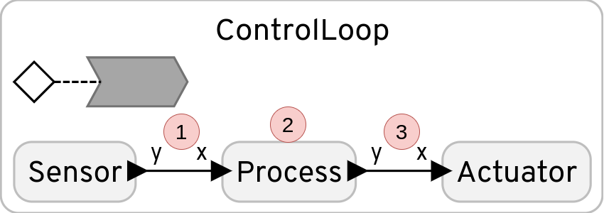

# esweek24

Setup for running benchmarks for paper in [Embedded Systems week](https://esweek.org/) 2024.

# Experiments

For this repository, experiments are conducted for four different platforms.
1. FlexPRET: a RISC-V precision-timed machine programmed in bare-metal C,
2. RP2040: an arm processor programmed in bare-metal C,
3. nrf52dk_nrf52832: an arm processor running Zephyr RTOS,
4. Raspberry Pi 3b+: an arm processor running a Linux-based OS.

The three latter span the typical design space of an embedded system; from bare-metal to an embedded OS to a "full-blown" OS. On the other hand, FlexPRET is a rather niche processor designed for mixed-criticality systems. The experiment results highlight the advantages of FlexPRET.

The purpose of the experiments is to evaluate jitter (time deviation of computations) on these four platforms, and techniques to mitigate them. These techniques include computer architecture design for predictable timing (e.g., precision-timed machines) and using programming languages with timing semantics (e.g., Lingua Franca).

## Physical setup

Figure 1 shows the physical setup for an experiment. The *platform* block is replaced by either of the four platforms, but can be replaced by any other platform as well. 

Figure 1: A diagram of the physical setup for an experiment.


The personal computer is connected to a [Digilent Analog Discovery](https://digilent.com/reference/test-and-measurement/analog-discovery-2/start), which acts as a waveform generator. Waveforms can be generated on at maximum two output pins - this setup generates *periodic* interrupts on one and *sporadic* interrupts on another. Waveform generation can be triggered by e.g., the rising edge of an external signal. This trigger signal is connected to a general-purpose IO (GPIO) pin on the target platform, and set high when the platform has finished initalization.

Each program/experiment running on the platform is implemented with the following basic structure:

1. Configure the pins connected to the waveform generator as interrupt pins, set interrupt handlers, and enable interrupts.
2. Set trigger signal high to trigger waveform generation.
3. Perform some computation for `N` iterations and append timestamps to a pre-allocated array.
4. Disable interrupts.
5. Print out the entire timestamp array to personal computer.

The timestamp arrays are then stored on disk and later analyzed.

The same program/experiment can be run with and without interrupts - the only difference is whether waveform generation on the Digilent Analog Discovery is enabled or disabled. The results show that running the experiments with interrupt generation introduces jitter into the timestamp array.

### Periodic vs. sporadic interrupts

Interrupts that arrive with some constant period (e.g., every 10 ms) are referred to as periodic interrupts. In an embedded system, this could typically be a sensor. 

Interrupts that arrive in a random/sporadic fashion are referred to as sporadic interrupts. This could for instance be packets arriving on a network interface. The characteristics of such packet arrivals are very application-based, but for this experiement it is assumed that a) multiple packets tend to arrive in a small time window and b) the network interface does not receive packets most of the time.

Figure 2: Periodic interrupts


Figure 3: Sporadic interrupts


### C vs. Lingua Franca

*The following assumes some knowledge of Lingua Franca.*

The experiments are implemented in both C and [Lingua Franca](https://www.lf-lang.org/) (LF). They both follow the same structure as described in [Physical setup](./README.md#physical-setup), but for LF the computation simulates a basic control loop. In addition, three timestamps are appended into an array, instead of just one. The three timestamp locations are denoted in Figure 4.

1. This is the connection from a sensor into a processing stage. The purpose of measuring the time here is to evaluate the jitter introduced by the Lingua Franca run-time.
2. In the processing stage, jitter is introduced by making the computation data-dependent. (For real applications, one would perhaps run some optimization algorithm, which runs longer for some input data.) The computation time in this stage is normally distributed.
3. In the third location, the jitter into the actuator is evaluted. Because the processing and actuator stages are coupled, jitter from the processing stage will directly translate into jitter in the actuator stage. (Spoiler: The solution is to use a *delayed connection* in LF.)

Figure 4: A basic control loop with lables for each location jitter is evaluted.


# Platform specifics

The four platforms all have their own setup guides.

## FlexPRET

For this experiment, FlexPRET is run on a Field-Programmable Gated Array (FPGA). FPGAs can be reconfigured to hold any digital circuit, implemented in hardware descriptive languages (HDL). 

To get FlexPRET running on an FPGA, refer to the documentation available in [FlexPRET's README.md](./lf-flexpret/flexpret/README.md). Make sure to build FlexPRET with at least three hardware threads - although four or eight are probably the most sensible options.

See Figure 5 for the physical setup.
1. This is a USB<->UART dongle used to communicate with FlexPRET. It is used to transmit software to FlexPRET's bootloader and acts as standard output after. The timestamp array is output here. Three jumpers are connected: `UART_RX`, `UART_TX` and ground.
2. This is the Digilent Analog Discovery used to generate waveform sinals. Four jumpers are connected: two waveform output signals, one trigger signal, and ground.
3. This is power to the Zedboard (upmost) and micro-USB to reconfigure the FPGA.

The exact mappings of the pins are not easily derived from Figure 5. This is on purpose, because the pin mapping is likely to become outdated. Refer to FlexPRET documentation or the relevant `.xdc` file to find this mapping.

Figure 5: The physical setup for FlexPRET.


## RP2040


## nrf52dk_nrf52832 (aka nrf52)


## Raspberry Pi 3b+ (aka RPi)

## Zephyr instructions

Follow steps 2-6 in the [official documentation](https://www.lf-lang.org/docs/embedded/zephyr#setting-up-the-lf-zephyr-workspace). (Version 0.6.0.)

Compile the program manually to test it works:
`west lfc ../lf/src/Control_nrf52.lf --build "-p always" --board nrf52dk_nrf52832`

Flash:
`west flash`


## FlexPRET instructions

FlexPRET uses a different version of the Lingua Franca compiler. Compile the lfc 0.4.1-SNAPSHOT in the following steps:

```
cd lf-flexpret/lingua-franca
./gradlew assemble
```

Verify that the version is correct:
`./bin/lfc --version`

Should output 0.4.1-SNAPSHOT.


## 3pi instructions

Follow the [official documentation](west lfc ../lf/src/Control_nrf52.lf --build "-p always" --board nrf52dk_nrf52832) for 3pi setup. (Version 0.6.0.)

Compile an example program to test it works:
`lfc src/HelloPico.lf`

Make sure you have `picotool` installed, which is used for loading executables.


## RPi instructions

Set up ssh keys and config.

Install WiringPi. Cmake


